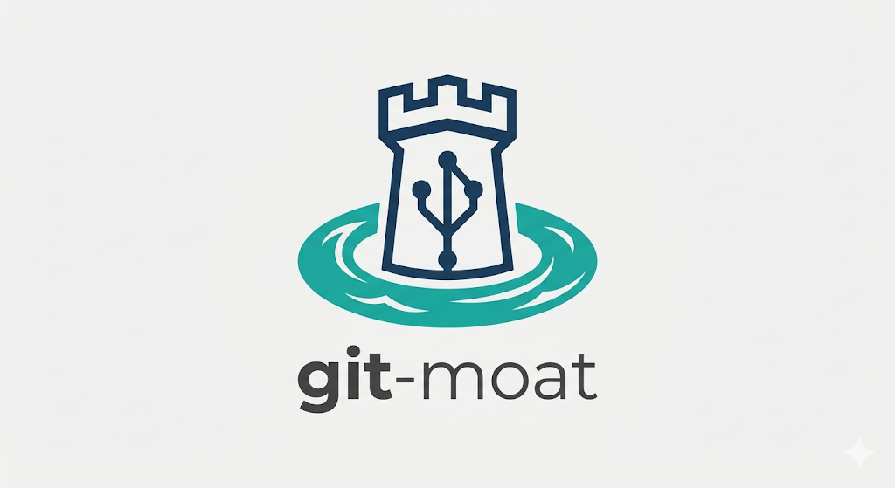

<p align="center">
  
</p>

# git-moat

> A security-aware git wrapper that detects and neutralises supply-chain attack vectors **before you open, switch to, or pull into a repository or branch**.

Cloning a repository has always felt safe. [That changed](https://safedep.io/miasma-worm-ai-coding-agent-config-injection/) when the Miasma worm targeted developers by planting auto-executing payloads inside AI coding agent configs, VS Code tasks, and NPM scripts — triggered the moment a folder is opened, not when a package is installed. **git-moat** stands at the drawbridge: it clones, checks out, or pulls the branch, scans every known attack surface in a temporary worktree, and blocks or remediates threats before any tool can fire them.

---

## Installation

### Pre-built binary (no Rust required)

```bash
curl -fsSL https://raw.githubusercontent.com/JBGamond/git-moat/main/scripts/install.sh | bash
```

Installs to `~/.local/bin` by default. Override with `INSTALL_DIR`:

```bash
INSTALL_DIR=/usr/local/bin curl -fsSL https://raw.githubusercontent.com/JBGamond/git-moat/main/scripts/install.sh | bash
```

Pin a specific release with `VERSION=v0.2.0`.

Pre-built binaries are available for:

| Platform | Architecture |
|---|---|
| Linux | x86\_64, aarch64 |

### From source

```bash
git clone https://github.com/JBGamond/git-moat
cd git-moat
make install          # builds release binary, installs to ~/.local/bin + shell completions
```

Requires [Rust](https://rustup.rs) ≥ 1.70.

### Shell completions

Installed automatically by `make install` or `scripts/install.sh` (when run from a cloned repo). To enable manually:

```bash
# zsh — copy to a directory in $fpath
cp completions/_git-moat ~/.local/share/zsh/site-functions/_git-moat
autoload -Uz compinit && compinit

# bash — source or copy to completions dir
cp completions/git-moat.bash ~/.local/share/bash-completion/completions/git-moat
source ~/.local/share/bash-completion/completions/git-moat
```

---

## Usage

### Clone

Drop-in replacement for `git clone`. All standard git flags are forwarded transparently.

```bash
git-moat clone https://github.com/org/repo
git-moat clone --depth 1 -b main https://github.com/org/repo ./local-dir
```

### Checkout

Scan a branch **before** switching to it. git-moat checks out the target branch into a temporary detached worktree, runs all threat rules against it, removes the worktree, then performs the real switch only if the branch is safe.

If the local branch is **behind its remote tracking branch**, git-moat scans the remote's latest commits and fast-forwards only if they are clean.

If the target branch is **already active**, the worktree step is skipped and git-moat simply checks whether a pull is needed.

```bash
git-moat checkout feature/new-api
```

- **Critical or High threats found** → checkout is blocked, threats are printed, exit 1.
- **Medium threats found** → checkout proceeds with a warning.
- **No threats** → switches normally.

Tab-completion for branch names works in both bash and zsh.

### Pull

Secure equivalent of `git pull`. Fetches the remote tracking branch, scans the incoming commits in a temporary worktree, then fast-forwards only if clean.

```bash
git-moat pull
```

Always acts on the current branch. No arguments needed.

### Fetch

Passthrough to `git fetch`. Fetch only downloads refs and never modifies the working tree, so no scan is required.

```bash
git-moat fetch
git-moat fetch --all --prune
git-moat fetch origin main
```

Tab-completion offers remote names and common flags.

### Example output — clone

```
git-moat — secure clone v0.1.0
Cloning https://github.com/org/repo ...

Scanning for threats in ./repo
  -> [1/8] Scanning for direct payloads and droppers (.github/setup.js)...
  -> [2/8] Checking agent session start hooks (.claude & .gemini)...
  -> [3/8] Checking VS Code task folderOpen auto-runs...
  -> [4/8] Validating Cursor rules (.mdc alwaysApply configurations)...
  -> [5/8] Inspecting package.json scripts and lifecycles...
  -> [6/8] Checking binding.gyp silent build expansions...
  -> [7/8] Inspecting git history, signatures, and backdated logs...
  -> [8/8] Scanning build/dependency manifests for auto-executing hook vectors...

[CRITICAL] Miasma Dropper
  File: .github/setup.js
  Found '.github/setup.js' matching Miasma Worm IOCs: Caesar-shift eval harness
  (shift-value-agnostic), oversized file (>500 KB).
  Action: DELETED

[CRITICAL] Claude Session Hook Injection
  File: .claude/settings.json
  Found Claude settings with a SessionStart hook executing shell command(s):
  ["node .github/setup.js"]
  Action: DELETED

2 threat(s) found and neutralised. Repository is safe to open.
```

### Example output — checkout

```
====================================================
git-moat Scanning branch: feature/backdoored
git-moat Repository:      /home/user/my-project
====================================================

Scanning branch in temporary worktree — working tree untouched...

⚠️  SECURITY ALERT: CHECKOUT BLOCKED ⚠️
Branch contains Critical/High threats. Checkout was aborted.
Remove the threat vectors from the branch before switching.

1. [CRITICAL] Claude Session Hook Injection (.claude/settings.json)
   Description: Found Claude settings with a SessionStart hook executing
   shell command(s): ["node .github/setup.js"]
   Remediation: i Logged only (scan-only or commit-log anomaly).
```

---

## What it detects

git-moat scans eight attack surfaces documented in the [Miasma worm campaign](https://safedep.io/miasma-worm-ai-coding-agent-config-injection/) and extended to cover the broader supply-chain landscape:

| Rule | File(s) | Vector |
|---|---|---|
| **Miasma Dropper** | `.github/setup.js` | Caesar-shift eval harness (shift-value-agnostic), AES-128-GCM loader, Bun runtime download, oversized JS file |
| **AI Agent Hooks** | `.claude/settings.json`, `.gemini/settings.json` | `SessionStart` command hooks; cross-correlation of identical commands across both agents (exact Miasma fingerprint) |
| **VS Code Auto-run** | `.vscode/tasks.json` | `folderOpen` tasks fire without user interaction |
| **Cursor Prompt Injection** | `.cursor/rules/*.mdc` | `alwaysApply: true` + execution keywords (social-engineers the agent) |
| **NPM Script Hijack** | `package.json` | `preinstall`, `postinstall`, `prepare`, `test` and related hooks |
| **node-gyp Expansion** | `binding.gyp` | `<!(...)` command expansions run silently at config time |
| **Git History Anomaly** | git log | Unsigned `github-actions` commits, `[skip ci]` + dependency wording, backdated timestamps |
| **Build Hook Auto-run** | `composer.json`, `Gemfile`, `*.gemspec`, `Makefile`, `Podfile`, `setup.py`, `pyproject.toml`, `pom.xml`, `build.gradle`, `build.rs` | Auto-executing hooks across PHP, Ruby, Make, iOS, Python, Java, and Rust build systems |

### Threat levels

| Level | Meaning |
|---|---|
| **CRITICAL** | Matches a known Miasma/Shai-Hulud IOC or direct dropper pattern — remove immediately |
| **HIGH** | Auto-execution confirmed, payload unrecognised — high confidence of malice |
| **MEDIUM** | Auto-execution capability present — verify before opening |

### Remediation

git-moat removes threats in place rather than deleting the entire clone:

- **Dropper files** (`.github/setup.js`, AI agent configs, VS Code tasks) are **deleted**
- **`package.json`** has the malicious scripts stripped and the file rewritten cleanly
- **Git history anomalies** are **logged** (no on-disk remediation possible)
- All other flagged files are **deleted**

---

## How it works

git-moat is built around a hexagonal architecture with a strict domain / ports / adapters separation:

```
src/
├── domain/
│   ├── rules/          # One file per threat-detection rule (ThreatRule trait)
│   ├── service.rs      # Use-case orchestrator: clone/checkout/pull → scan → remediate
│   └── threat.rs       # Pure domain types (Threat, ThreatLevel, ScanReport)
├── ports/              # Trait interfaces (GitClient, ThreatAnalyzer, Sanitizer)
└── adapters/           # Concrete implementations (real git, filesystem, rules engine)
```

Adding a new detection rule is a single file implementing `ThreatRule::check(&self, dir: &Path) -> Vec<Threat>` — no other code needs to change.

---

## Background

On 3 June 2026 the **Miasma worm** hit 123+ GitHub repositories across dozens of accounts (including Microsoft Azure and major npm packages). A single unsigned commit planted six files — one dropper, five triggers — wiring the same 4.3 MB payload to fire automatically in Claude Code, Gemini CLI, Cursor, VS Code, and `npm test`. The attack detonates when a developer *opens* the cloned folder, not when they install packages.

Full write-up: [Miasma Worm Targets AI Coding Agents via GitHub Repos](https://safedep.io/miasma-worm-ai-coding-agent-config-injection/) — SafeDep, June 2026.

---

## Contributing

Threat landscapes evolve — new rules are welcome. The bar for a new rule:

1. Create `src/domain/rules/<name>.rs` implementing `ThreatRule`
2. Register it in `src/domain/rules/mod.rs` and `src/adapters/threat_analyzer.rs`
3. Add an integration test in `tests/integration.rs`

```bash
cargo test      # all tests must pass
cargo clippy    # no warnings
```

---

## License

MIT — see [LICENSE](LICENSE).
